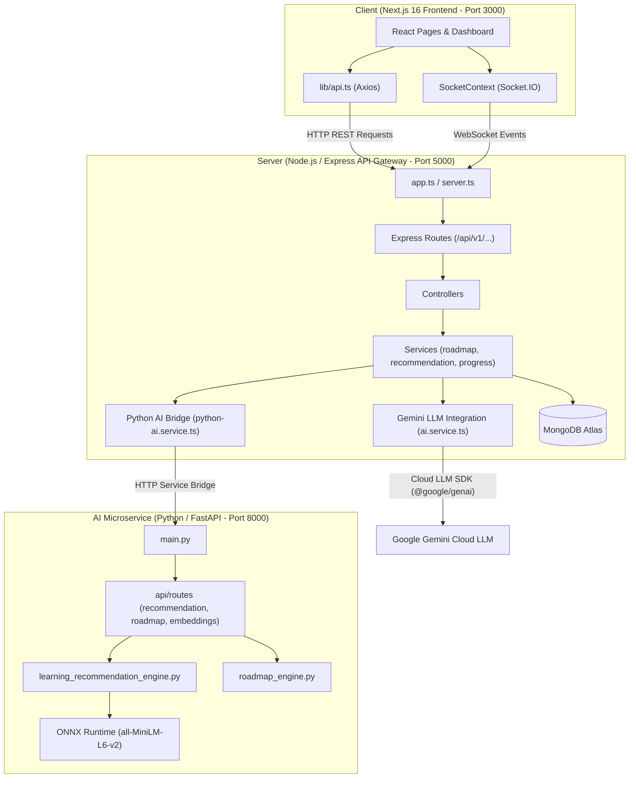
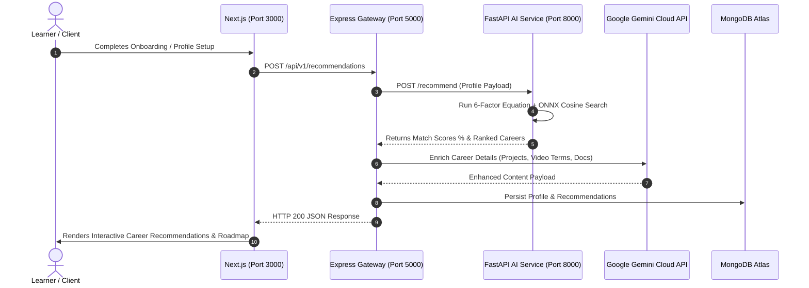

# CAREER FOR ME

> **AI-Powered Personalized Career and Learning Path Recommendation SaaS**  
> *Deterministic ML + Generative Cloud LLM Hybrid Platform*

---

## 🎯 Executive Overview

**Career For Me** is an enterprise-grade prototype SaaS application designed to help learners and professionals navigate career transitions through hyper-personalized, AI-driven learning paths. It combines a **deterministic 6-factor ML recommendation engine** with **Google Gemini generative LLMs** to offer:

* 📊 **Deterministic Match Scoring**: Explainable percentage compatibility based on 6 core profile factors.
* 🎯 **Skill-Gap Categorization**: Identifies acquired, in-progress, and missing critical skill dependencies.
* 🗺️ **4-Phase Adaptive Roadmaps**: Dynamically sequences learning milestones with practical project prompts, docs, video terms, and interactive DAG flowchart diagrams.
* 💬 **Contextual RAG Career Mentor**: Real-time conversational AI mentor streamed via Server-Sent Events (SSE).
* 🛡️ **3-Tier Fault-Tolerant Resilience**: Guarantees zero downtime via automatic fallback layers.

---

## 🏛️ System Architecture & Design Topology

Career For Me uses a **Hybrid Microservice Architecture** that decouples heavy deterministic calculations from generative cloud services.



### 🛡️ 3-Tier Multi-Layer Fallback Strategy
1. **Tier 1 (Python AI Microservice)**: Primary calculation engine for 6-factor scoring, ONNX sentence embeddings, and prerequisite graph ordering.
2. **Tier 2 (Gemini Direct Fallback)**: If Python AI service is unreachable, Node.js invokes Gemini Cloud LLM directly to score and structure recommendations.
3. **Tier 3 (Local Rule Engine)**: If cloud services are unavailable, local static dataset rules ([careers.dataset.ts](server/src/data/careers.dataset.ts)) serve recommendations without application crashes.

### ⚡ Memory-Optimized CPU Architecture (Render 512 MiB RAM)
* **ONNX Runtime CPU**: Replaced PyTorch (`torch`) with `xenova/all-MiniLM-L6-v2` in INT8 ONNX format.
* **Low Memory Footprint**: Reduces RAM consumption from **>1.2 GB to ~35-45 MB**.
* **Precomputed Vector Store**: Preloaded `career_embeddings.npz` (384-d normalized dense vectors) enables **<1 sec** startup and instant NumPy cosine searches.

---

## 🔄 End-to-End Data Flow



---

## 🧠 AI Subsystem & Mathematical Formulation

### 1. The 6-Factor Hybrid Scoring Equation

$$\text{MatchScore} = 0.40 \cdot \text{SkillMatch} + 0.20 \cdot \text{InterestMatch} + 0.15 \cdot \text{GoalMatch} + 0.10 \cdot \text{ExpMatch} + 0.05 \cdot \text{EduMatch} + 0.10 \cdot \text{SemanticMatch}$$

| Factor | Weight | Formula / Logic |
| :--- | :---: | :--- |
| **Skill Match** | **40%** | $\frac{|\text{UserSkills} \cap \text{RequiredSkills}|}{|\text{RequiredSkills}|} \times 100$ |
| **Interest Match** | **20%** | Overlap between user interests and target domain tags. |
| **Goal Alignment** | **15%** | Direct role match (`100%`), domain match (`75%`), general (`40%`). |
| **Experience Match** | **10%** | Alignment between experience level (Beginner/Mid/Senior) and role difficulty. |
| **Education Match** | **5%** | STEM degree (`100%`), Bootcamp (`85%`), Self-taught (`70%`). |
| **Semantic Match** | **10%** | Cosine similarity $\cos(\mathbf{e}_{\text{profile}}, \mathbf{e}_{\text{career}}) \times 100$ via ONNX `all-MiniLM-L6-v2`. |

### 2. Skill Gap Prioritization
Missing skills are categorized into:
* **Acquired / Strong**: Proficiency $\ge 4/5$.
* **In Progress / Needs Work**: Proficiency $1-3/5$.
* **Missing Critical Gaps**: Not currently possessed by the learner.

### 3. 4-Phase Roadmap Engine
* **Phase 1: Foundations**: Core prerequisites & tooling.
* **Phase 2: Core Competencies**: Required technical skills.
* **Phase 3: Advanced Topics**: Frameworks & architectural patterns.
* **Phase 4: Capstone Projects**: Real-world portfolio projects & career readiness.

---

## 📂 Repository & Folder Structure

```
Path Finder/
├── ai-service/                   # Python FastAPI AI Microservice (Port 8000)
│   ├── app/                      # Application Root
│   │   ├── api/routes/           # Routes (recommendation.py, roadmap.py, health.py)
│   │   ├── config/               # Settings & Configuration
│   │   ├── data/                 # Datasets (courses.json, careers.json, skills.json)
│   │   ├── models/               # Domain Models (course.py, career.py, skill.py)
│   │   ├── services/             # Recommendation, Skill Gap & Roadmap Engines
│   │   └── main.py               # FastAPI Entrypoint
│   ├── scripts/                  # Precompute embeddings script
│   ├── tests/                    # Pytest Suite
│   ├── requirements.txt          # Lightweight CPU Python Dependencies
│   └── README.md                 # AI Service Documentation
│
├── server/                       # Express Node.js & TypeScript Backend (Port 5000)
│   ├── src/
│   │   ├── config/               # DB & Env Config (db.ts, env.ts)
│   │   ├── controllers/          # Controllers (recommendation, roadmap, auth, profile)
│   │   ├── middleware/           # Auth (JWT), Error & Validation Middleware
│   │   ├── models/               # Mongoose Schemas (User.ts, LearnerProfile.ts, Roadmap.ts)
│   │   ├── routes/               # Express API Routes
│   │   ├── services/             # Logic Services, Python Bridge & Gemini Service
│   │   ├── utils/                # Benchmarks, Seeding & Helper Utilities
│   │   ├── app.ts                # Express Setup
│   │   ├── server.ts             # Server Listener Entrypoint
│   │   └── socket.ts             # Socket.IO Real-time WebSocket Handler
│   ├── package.json              # Server NPM Dependencies & Scripts
│   └── tsconfig.json             # TypeScript Configuration
│
├── client/                       # Next.js 16 React Frontend (Port 3000)
│   ├── src/
│   │   ├── app/                  # Next.js App Router Pages
│   │   ├── components/           # UI, Layout, Landing & Profile Components
│   │   ├── context/              # Auth & Socket Context Providers
│   │   ├── lib/                  # Axios Client (api.ts) & Utilities
│   │   └── types/                # TypeScript Interfaces & API Types
│   ├── package.json              # Client NPM Dependencies
│   └── next.config.ts            # Next.js Configuration
│
├── docs/                         # Exhaustive Architecture Documentation (00 to 17)
├── ai.md                         # Detailed AI Subsystem & Hybrid Architecture Guide
└── diagram.md                    # File Index & Architecture Diagrams
```

---

## 🛠️ Complete Project Setup Guide

Follow this guide to configure and run the full stack locally (Python FastAPI AI Microservice, Node.js/Express API Gateway, MongoDB, and Next.js 16 Client).

---

### 📋 Prerequisites

Ensure you have the following installed on your system before proceeding:

* **Node.js**: `v18.x` or `v20.x` (LTS recommended) & **npm** `v9.x+`
* **Python**: `v3.10.x` or `v3.11.x`
* **MongoDB**: Local MongoDB instance running on `mongodb://localhost:27017` or a [MongoDB Atlas](https://www.mongodb.com/cloud/atlas) connection string.
* **Git**: `v2.x+`

---

### 1️⃣ Clone the Repository

```bash
git clone https://github.com/sagarkumar62/Path-Finder.git
cd Path-Finder
```

---

### 2️⃣ Environment Variables Configuration

Copy and configure environment files for all three microservices:

#### A. Express Backend Server (`server/.env`)
Create `server/.env` based on `server/.env.example`:
```ini
PORT=5000
NODE_ENV=development

# Database Connection (MongoDB Atlas or Local)
MONGODB_URI=mongodb://localhost:27017/career_pathfinder

# Authentication Secrets
JWT_ACCESS_SECRET=your_jwt_access_secret_key_here
JWT_REFRESH_SECRET=your_jwt_refresh_secret_key_here
ACCESS_TOKEN_EXPIRES_IN=15m
REFRESH_TOKEN_EXPIRES_IN=7d

# URLs & Services
FRONTEND_URL=http://localhost:3000
AI_SERVICE_URL=http://localhost:8000
AI_SERVICE_TIMEOUT=30000
AI_MOCK_MODE=false

# Optional Gemini Direct Integration
GEMINI_API_KEY=your_google_gemini_api_key
```

#### B. Python AI Microservice (`ai-service/.env`)
Create `ai-service/.env` based on `ai-service/.env.example`:
```ini
GEMINI_API_KEY=your_google_gemini_api_key
GEMINI_MODEL=gemini-1.0
NODE_BACKEND_URL=http://localhost:5000
AI_SERVICE_PORT=8000
AI_MOCK_MODE=false
EMBEDDING_MODEL=all-MiniLM-L6-v2
AI_SERVICE_TIMEOUT=30000
```

#### C. Next.js Client (`client/.env.local`)
Create `client/.env.local` based on `client/.env.example`:
```ini
NEXT_PUBLIC_API_URL=http://localhost:5000/api/v1
NEXT_PUBLIC_API_BASE_URL=http://localhost:5000/api/v1
```

---

### 3️⃣ Step-by-Step Microservice Launch

#### 🔵 Step 1: Start Python AI Microservice (Port 8000)
```bash
cd ai-service

# Create virtual environment
python -m venv .venv

# Activate virtual environment
# Windows PowerShell:
.venv\Scripts\Activate.ps1
# Linux / macOS:
source .venv/bin/activate

# Install dependencies
pip install -r requirements.txt

# (Optional) Precompute vector embeddings
python scripts/precompute_embeddings.py

# Start FastAPI server
uvicorn app.main:app --host 0.0.0.0 --port 8000 --reload
```
*Verify AI Microservice is running at `http://localhost:8000/docs` (Swagger UI).*

#### 🟢 Step 2: Seed & Start Express Backend Server (Port 5000)
Open a new terminal window:
```bash
cd server

# Install Node.js dependencies
npm install

# Seed MongoDB with canonical career definitions and initial datasets
npm run seed

# Start Express dev server with live reloads
npm run dev
```
*Verify Express Backend is running at `http://localhost:5000/health` or `http://localhost:5000/api/v1/health`.*

#### 🟣 Step 3: Start Next.js Client Frontend (Port 3000)
Open a third terminal window:
```bash
cd client

# Install frontend dependencies
npm install

# Start Next.js development server
npm run dev
```
*Open `http://localhost:3000` in your web browser.*

---

### 🧪 Verification & Testing

To verify end-to-end functionality across components:

#### 1. Express Integration Test Suite
```bash
cd server
npm run test
```

#### 2. AI Precision & Recommendation Evaluation Benchmark
```bash
cd server
npx tsx src/utils/ai-evaluation.ts
```

#### 3. Python AI Microservice Unit Tests
```bash
cd ai-service
pytest
```

---

## 📊 Evaluation & Precision Benchmarks

Career For Me includes an automated evaluation suite ([`server/src/utils/ai-evaluation.ts`](server/src/utils/ai-evaluation.ts)) to verify recommendation precision:

* **Top-1 Precision Accuracy**: `100.0%` (5/5 target careers ranked #1 for matching test personas).
* **Top-3 Recall Precision**: `100.0%` (5/5 target careers present in Top 3 recommendation list).

---

## 📖 Key Documentation Links & Module Setup Guides

* [`server/README.md`](server/README.md) — Complete Express Backend Server Setup Guide
* [`ai-service/README.md`](ai-service/README.md) — Complete Python FastAPI AI Microservice Setup Guide
* [`client/README.md`](client/README.md) — Complete Next.js Client Frontend Setup Guide
* [`docs/`](docs/) — Complete system documentation series (00 through 17)
* [`ai.md`](ai.md) — Deep technical guide for the AI Subsystem
* [`diagram.md`](diagram.md) — Exhaustive path index and architecture flow maps

