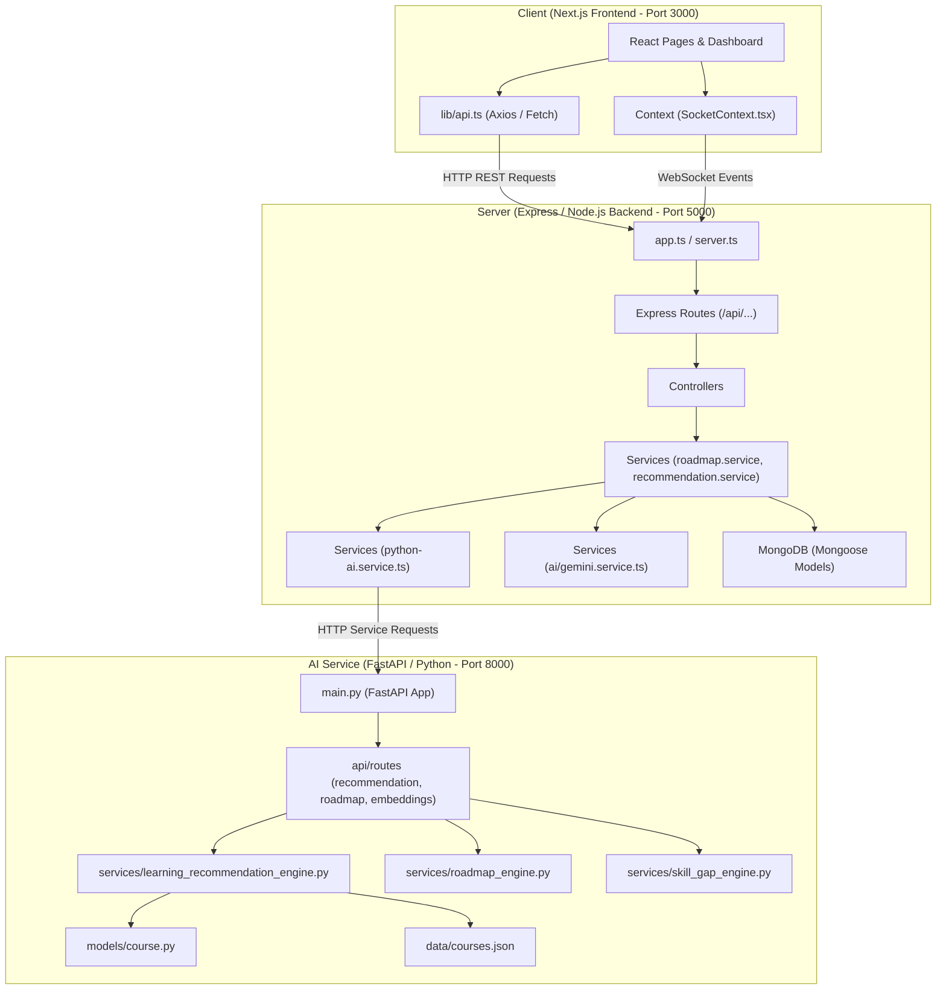

# Career For Me — Comprehensive File Architecture & Path Diagram

This document contains the structural path map, system relationship flow diagram, and file index for the **Career For Me** ecosystem across `ai-service`, `server`, and `client`.

---

## 1. High-Level Architecture Flow Diagram



---

## 2. Directory & Path Tree Overview

```
Path Finder/
├── ai-service/                   # Python FastAPI Microservice (AI & Recommendation Engine)
│   ├── app/                      # Core FastAPI Application Code
│   │   ├── api/                  # API Endpoint Handlers & Routers
│   │   │   └── routes/           # Recommendation, Roadmap, Search & Health Routes
│   │   ├── config/               # App Settings & Environment Configuration
│   │   ├── data/                 # Canonical Datasets (courses.json, careers.json, skills.json)
│   │   ├── embeddings/           # FAISS Vector Indices & Vector Stores
│   │   ├── ingestion/            # Dataset Import & Pipeline Utilities
│   │   ├── models/               # Pydantic Domain Models (course.py, career.py, skill.py)
│   │   ├── schemas/              # Pydantic API Request/Response Schemas
│   │   ├── services/             # Recommendation, Skill Gap & Graph Generation Engines
│   │   ├── utils/                # Normalization & Text Sanitization Utilities
│   │   └── main.py               # FastAPI App Entrypoint
│   ├── scripts/                  # Data Loader & Embedding Training Scripts
│   ├── tests/                    # Pytest Suite (Course Model, Engine & Pipeline Tests)
│   ├── verify_careers.py         # Career Taxonomy Integrity Verifier
│   └── requirements.txt          # Python Dependencies
│
├── server/                       # Node.js Express Backend API
│   ├── src/                      # TypeScript Source Code
│   │   ├── config/               # Database & Environment Setup
│   │   ├── controllers/          # HTTP Request Controllers
│   │   ├── middleware/           # Auth, Error & Validation Middleware
│   │   ├── models/               # Mongoose Database Models
│   │   ├── routes/               # Express Route Definitions
│   │   ├── services/             # Business Logic & Microservice Bridges
│   │   │   └── ai/               # Gemini AI & Career Context Integration
│   │   ├── utils/                # Response Formatting, JWT & Taxonomy Helpers
│   │   ├── validators/           # Zod / Joi Request Schemas
│   │   ├── app.ts                # Express App Setup
│   │   ├── server.ts             # Server Entrypoint
│   │   └── socket.ts             # WebSocket / Socket.IO Controller
│   ├── package.json              # Server NPM Dependencies
│   └── tsconfig.json             # Server TypeScript Configuration
│
└── client/                       # Next.js React Frontend Application
    ├── src/                      # Frontend Source Code
    │   ├── app/                  # Next.js App Router (Dashboard, Roadmap, Onboarding, Profile)
    │   ├── components/           # Reusable UI Components
    │   │   ├── auth/             # Authentication Dialogs & Forms
    │   │   ├── landing/          # Landing Page Sections (Hero, HowItWorks, Spotlight)
    │   │   ├── layout/           # App Layout Shells
    │   │   ├── profile/          # Profile Management Components
    │   │   └── ui/               # Base Design Components (Button, Card, Badge)
    │   ├── context/              # React Context Providers (AuthContext, SocketContext)
    │   ├── lib/                  # Client Utilities & API Client (api.ts)
    │   ├── providers/            # React Query & Provider Wrappers
    │   └── types/                # TypeScript Interfaces & API Types
    ├── package.json              # Client NPM Dependencies
    └── next.config.ts            # Next.js Framework Configuration
```

---

## 3. Exhaustive File Path Index

### 🔵 AI Service (`ai-service/`)

| Relative Path | Description | Link |
| :--- | :--- | :--- |
| `ai-service/app/main.py` | FastAPI application initialization & middleware setup | [main.py](ai-service/app/main.py) |
| `ai-service/app/models/course.py` | Canonical Course Pydantic models (`Course`, `CourseSkill`, `CoursePrerequisite`) | [course.py](ai-service/app/models/course.py) |
| `ai-service/app/models/career.py` | Career requirement domain models | [career.py](ai-service/app/models/career.py) |
| `ai-service/app/models/skill.py` | Skill taxonomy models | [skill.py](ai-service/app/models/skill.py) |
| `ai-service/app/models/__init__.py` | Model package exports | [\_\_init\_\_.py](ai-service/app/models/__init__.py) |
| `ai-service/app/data/courses.json` | 50+ Seed Course database with proficiency targets & prerequisites | [courses.json](ai-service/app/data/courses.json) |
| `ai-service/app/data/careers.json` | Career definitions and required skills | [careers.json](ai-service/app/data/careers.json) |
| `ai-service/app/data/skills.json` | Canonical skill taxonomy list | [skills.json](ai-service/app/data/skills.json) |
| `ai-service/app/data/aliases.json` | Skill name aliases map | [aliases.json](ai-service/app/data/aliases.json) |
| `ai-service/app/services/learning_recommendation_engine.py` | Heuristic multi-stage recommendation pipeline | [learning_recommendation_engine.py](ai-service/app/services/learning_recommendation_engine.py) |
| `ai-service/app/services/roadmap_engine.py` | Multi-phase learning path generation engine | [roadmap_engine.py](ai-service/app/services/roadmap_engine.py) |
| `ai-service/app/services/skill_gap_engine.py` | Skill gap analysis & target proficiency calculator | [skill_gap_engine.py](ai-service/app/services/skill_gap_engine.py) |
| `ai-service/app/services/graph_generator.py` | Prerequisite graph & DAG builder | [graph_generator.py](ai-service/app/services/graph_generator.py) |
| `ai-service/app/services/career_resolver.py` | Career title resolution engine | [career_resolver.py](ai-service/app/services/career_resolver.py) |
| `ai-service/app/services/faiss_index.py` | FAISS vector indexing service | [faiss_index.py](ai-service/app/services/faiss_index.py) |
| `ai-service/app/api/routes/recommendation.py` | Learning recommendation endpoint routes | [recommendation.py](ai-service/app/api/routes/recommendation.py) |
| `ai-service/app/api/routes/roadmap.py` | Learning roadmap generation routes | [roadmap.py](ai-service/app/api/routes/roadmap.py) |
| `ai-service/app/api/routes/health.py` | Service health check route | [health.py](ai-service/app/api/routes/health.py) |
| `ai-service/app/utils/normalization.py` | Text normalization & string matching utilities | [normalization.py](ai-service/app/utils/normalization.py) |
| `ai-service/app/config/settings.py` | Environment settings and defaults | [settings.py](ai-service/app/config/settings.py) |
| `ai-service/tests/test_course_model.py` | Course model & dataset unit tests | [test_course_model.py](ai-service/tests/test_course_model.py) |
| `ai-service/tests/test_learning_recommendation_engine.py` | Recommendation pipeline unit tests | [test_learning_recommendation_engine.py](ai-service/tests/test_learning_recommendation_engine.py) |
| `ai-service/verify_careers.py` | Career dataset validation script | [verify_careers.py](ai-service/verify_careers.py) |
| `ai-service/requirements.txt` | Python dependencies list | [requirements.txt](ai-service/requirements.txt) |

---

### 🟢 Server (`server/`)

| Relative Path | Description | Link |
| :--- | :--- | :--- |
| `server/src/server.ts` | Server bootstrap and listener setup | [server.ts](server/src/server.ts) |
| `server/src/app.ts` | Express application middleware & route registrations | [app.ts](server/src/app.ts) |
| `server/src/socket.ts` | Real-time WebSocket connection handler | [socket.ts](server/src/socket.ts) |
| `server/src/config/db.ts` | MongoDB Mongoose connection configuration | [db.ts](server/src/config/db.ts) |
| `server/src/config/env.ts` | Environment variables loader | [env.ts](server/src/config/env.ts) |
| `server/src/routes/recommendation.routes.ts` | Course recommendation API routes | [recommendation.routes.ts](server/src/routes/recommendation.routes.ts) |
| `server/src/routes/roadmap.routes.ts` | Learning roadmap API routes | [roadmap.routes.ts](server/src/routes/roadmap.routes.ts) |
| `server/src/routes/auth.routes.ts` | Authentication API routes | [auth.routes.ts](server/src/routes/auth.routes.ts) |
| `server/src/routes/profile.routes.ts` | Learner profile API routes | [profile.routes.ts](server/src/routes/profile.routes.ts) |
| `server/src/routes/progress.routes.ts` | Learning progress API routes | [progress.routes.ts](server/src/routes/progress.routes.ts) |
| `server/src/controllers/recommendation.controller.ts` | Recommendation endpoint controller | [recommendation.controller.ts](server/src/controllers/recommendation.controller.ts) |
| `server/src/controllers/roadmap.controller.ts` | Roadmap generation controller | [roadmap.controller.ts](server/src/controllers/roadmap.controller.ts) |
| `server/src/controllers/auth.controller.ts` | User login/registration controller | [auth.controller.ts](server/src/controllers/auth.controller.ts) |
| `server/src/services/recommendation.service.ts` | Recommendation business logic & scoring | [recommendation.service.ts](server/src/services/recommendation.service.ts) |
| `server/src/services/python-ai.service.ts` | Microservice bridge to Python `ai-service` | [python-ai.service.ts](server/src/services/python-ai.service.ts) |
| `server/src/services/ai/gemini.service.ts` | Google Gemini AI model integration | [gemini.service.ts](server/src/services/ai/gemini.service.ts) |
| `server/src/models/LearnerProfile.ts` | MongoDB Learner Profile model schema | [LearnerProfile.ts](server/src/models/LearnerProfile.ts) |
| `server/src/models/Roadmap.ts` | MongoDB Roadmap model schema | [Roadmap.ts](server/src/models/Roadmap.ts) |
| `server/src/models/User.ts` | MongoDB User Account model schema | [User.ts](server/src/models/User.ts) |
| `server/src/middleware/auth.middleware.ts` | JWT Authentication middleware | [auth.middleware.ts](server/src/middleware/auth.middleware.ts) |
| `server/src/utils/seed.ts` | Database seeding script | [seed.ts](server/src/utils/seed.ts) |
| `server/package.json` | Express Server NPM dependencies | [package.json](server/package.json) |

---

### 🟣 Client (`client/`)

| Relative Path | Description | Link |
| :--- | :--- | :--- |
| `client/src/app/page.tsx` | Main landing page | [page.tsx](client/src/app/page.tsx) |
| `client/src/app/layout.tsx` | Root Next.js layout component | [layout.tsx](client/src/app/layout.tsx) |
| `client/src/app/dashboard/page.tsx` | Main learner dashboard view | [dashboard/page.tsx](client/src/app/dashboard/page.tsx) |
| `client/src/app/roadmap/page.tsx` | Interactive roadmap visualization view | [roadmap/page.tsx](client/src/app/roadmap/page.tsx) |
| `client/src/app/recommendations/page.tsx` | Course recommendations view | [recommendations/page.tsx](client/src/app/recommendations/page.tsx) |
| `client/src/app/skill-gap/page.tsx` | Skill gap analysis view | [skill-gap/page.tsx](client/src/app/skill-gap/page.tsx) |
| `client/src/app/onboarding/page.tsx` | User onboarding flow | [onboarding/page.tsx](client/src/app/onboarding/page.tsx) |
| `client/src/app/profile/page.tsx` | Learner profile settings page | [profile/page.tsx](client/src/app/profile/page.tsx) |
| `client/src/lib/api.ts` | Axios HTTP client & API service calls | [api.ts](client/src/lib/api.ts) |
| `client/src/types/index.ts` | TypeScript types for API contracts & UI state | [index.ts](client/src/types/index.ts) |
| `client/src/context/AuthContext.tsx` | React authentication context & session manager | [AuthContext.tsx](client/src/context/AuthContext.tsx) |
| `client/src/context/SocketContext.tsx` | Real-time WebSocket context provider | [SocketContext.tsx](client/src/context/SocketContext.tsx) |
| `client/src/components/layout/AppLayout.tsx` | Main dashboard & app layout shell | [AppLayout.tsx](client/src/components/layout/AppLayout.tsx) |
| `client/src/components/ui/match-score.tsx` | Recommendation score indicator component | [match-score.tsx](client/src/components/ui/match-score.tsx) |
| `client/src/components/landing/Hero.tsx` | Landing page hero banner | [Hero.tsx](client/src/components/landing/Hero.tsx) |
| `client/package.json` | Next.js Frontend NPM dependencies | [package.json](client/package.json) |
| `client/next.config.ts` | Next.js configuration settings | [next.config.ts](client/next.config.ts) |
